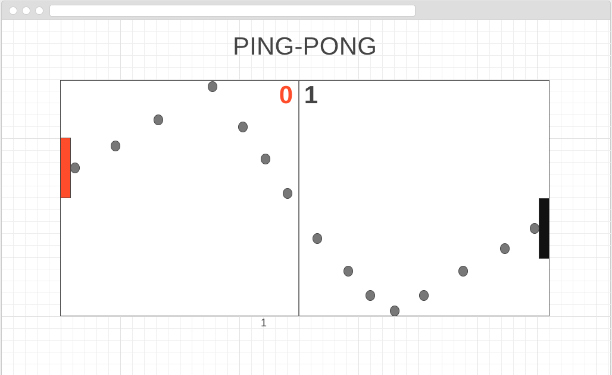

# PING-PONG #
- - -

## OBJECTIVE ##
To keep the ball in play as long as possible.

## PLAY THE GAME HERE ##
http://pingpong-vp.surge.sh/

## MOTIVATION ##
To create a rallying game to help ping-pong players visualize their strategy before their game.

## PROTOTYPE ##

## TECH ##
HTML-5 Canvas,CSS, and Javascript

## USER PERSONA 1 ##
Josh is an avid ping-pong player. Ping-pong provides a good outlet for his high stress job. He would love to have a virtual stimulator of the game when he is not able to physical go and play the game.

## USER PERSONA 2 ##
Betty is a professional ping-pong player. She uses this game to get in the mindset before her games.

## STRETCH GOALS ##
Adding sound effects when the ball hits the paddles and creating a particle effect upon ball striking the paddles
